# 第三次大作业

何宇航 21301095

---

技术栈

初始账户：
分别对应不同的角色，查看到的菜单数量也不同
1. admin/123456
2. user/123456
3. user2/123456

### 登录注册

#### 登录

点击登录按钮后，实现账户的登录，会自动进行页面的跳转。
同时也会检测密码的长度、用户名是否存在、密码是否正确。
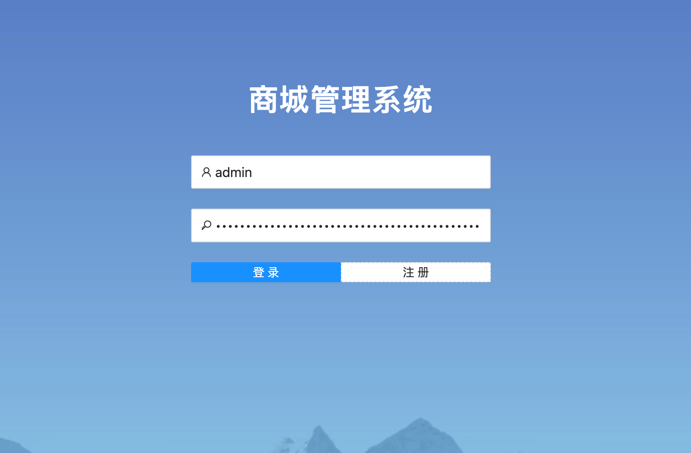

#### 注册

点击注册按钮后，实现对账户的注册，用户进行注册需要输入用户名、密码与邮箱。

此时会对邮箱的格式进行判定，同时也会对密码的长度进行判定。
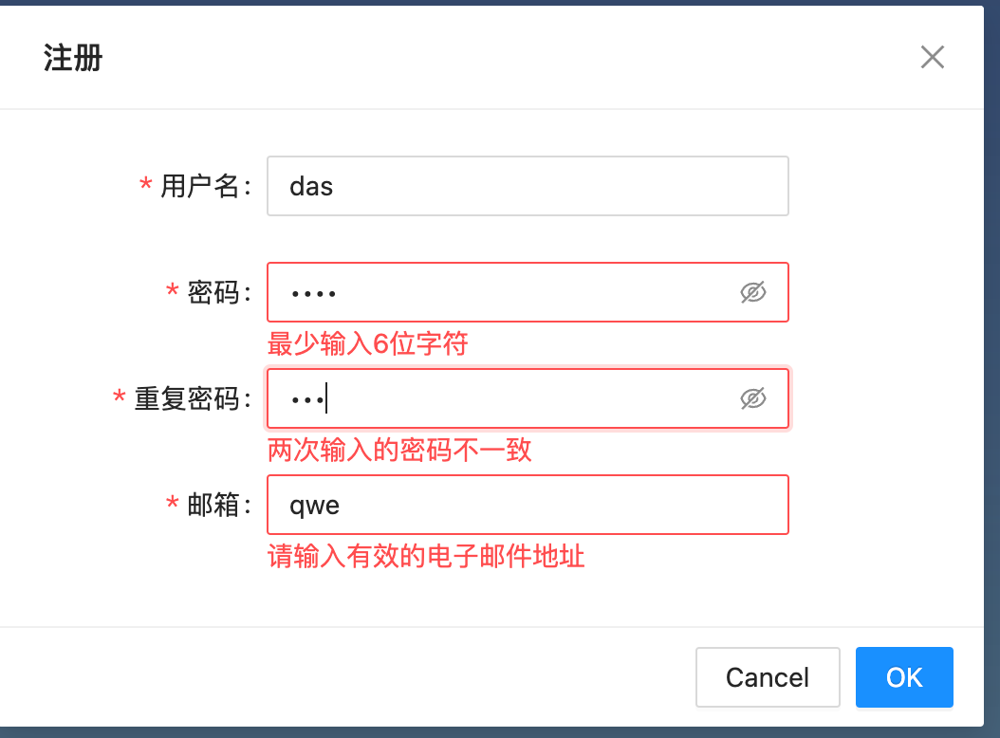

密码的存储采用SHA-256的方式进行加密，以此保证用户数据的安全。
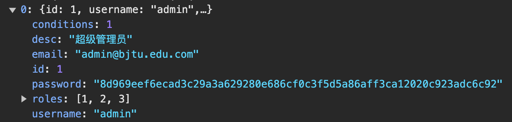

同时也对密码的复杂度进行检验，密码必须包含大小写字母及数字。
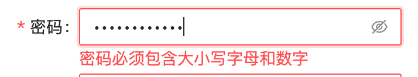

### 菜单管理

#### 菜单整体架构

菜单采取树形结构，子菜单下还有更小一级的菜单
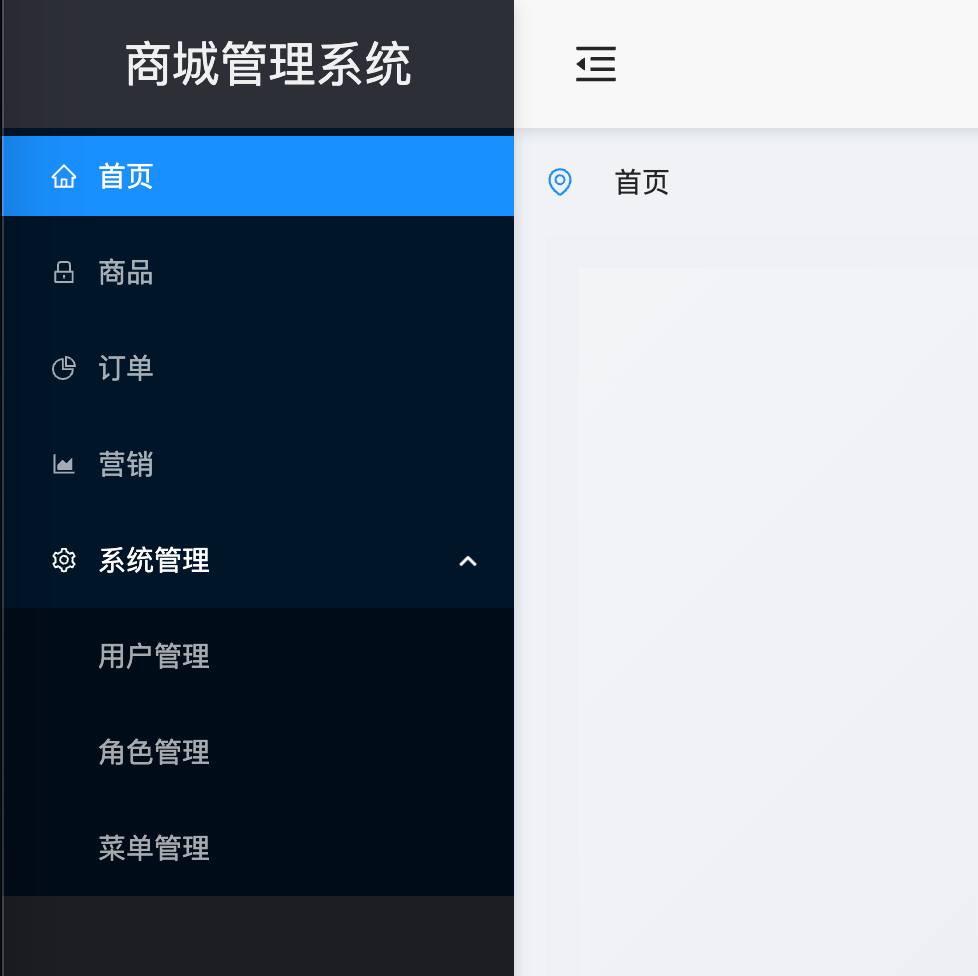

#### 菜单增删改查

菜单增删改查界面如下图所示，用户可以在目录略缩中选取需要进行修改的菜单级别，然后点击对应的按钮即可完成对菜单的添加

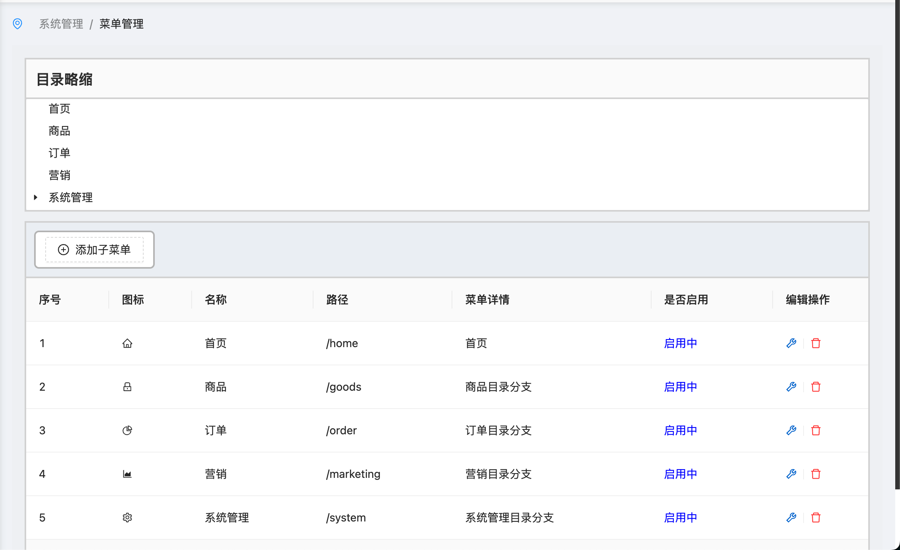

新增菜单页面，在此页面中，用户需要填写菜单的名称、url、排序和状态，同时可选填写图标，功能描述。
需要注意的是添加完菜单后，菜单默认不显示，需要对不同的角色进行授权。

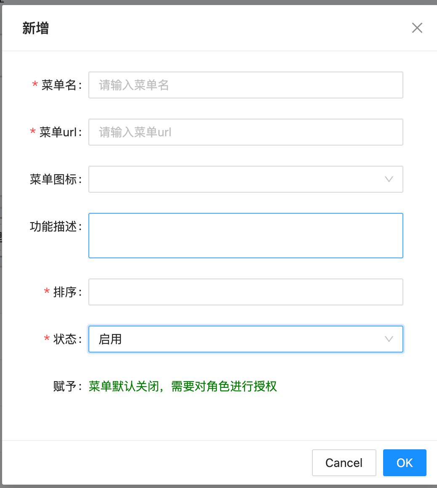

添加新菜单信息，并添加。
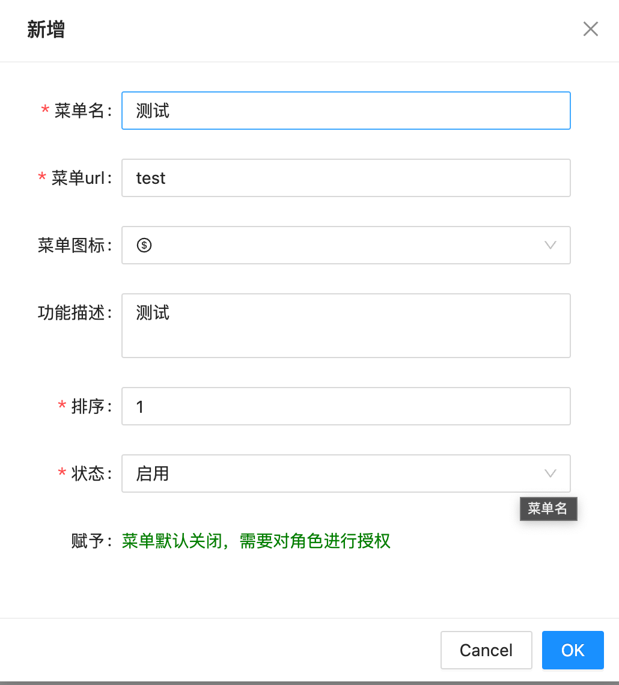
分配权限后，重新登录，可以看到新的菜单，点击菜单管理中的编辑操作，可以对菜单信息进行更改，同时也可以点击删除操作，删除指定的菜单。
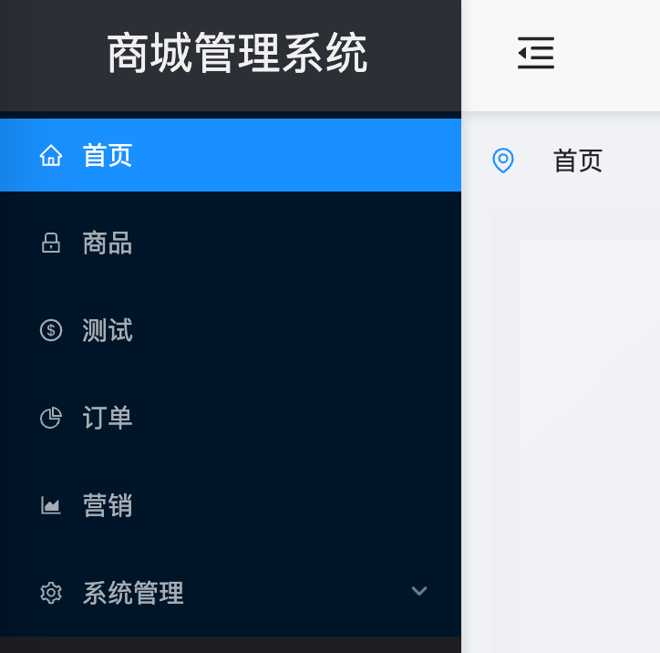

### 用户管理

在用户管理界面，管理员可以直接添加用户，同时也可以禁用用户。
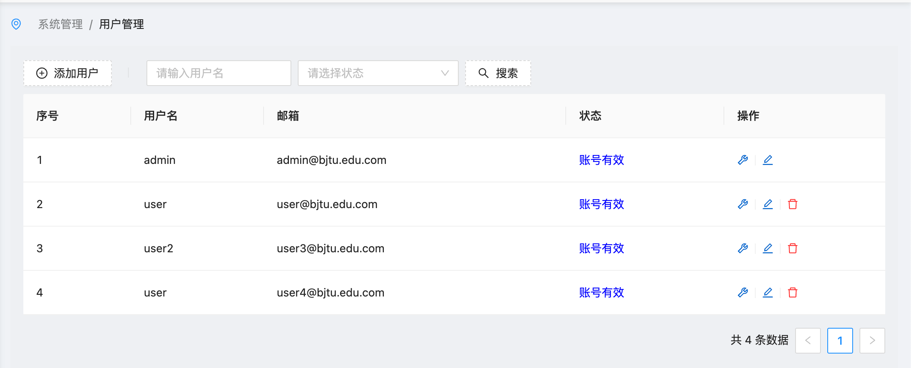

在新增用户弹窗中，管理员选择输入用户名、密码、邮箱等信息，实现对用户的直接添加
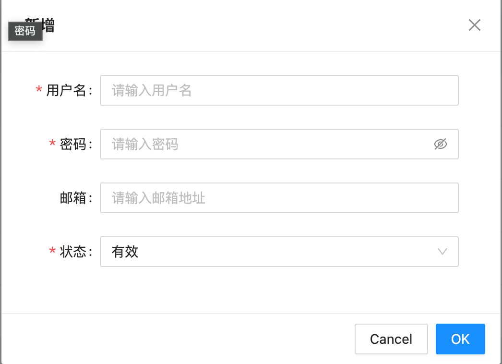

同时，管理员可以选择对不同用户的角色进行分配，共有三种角色可以选择，分别为超级管理员、普通管理员与普通用户。
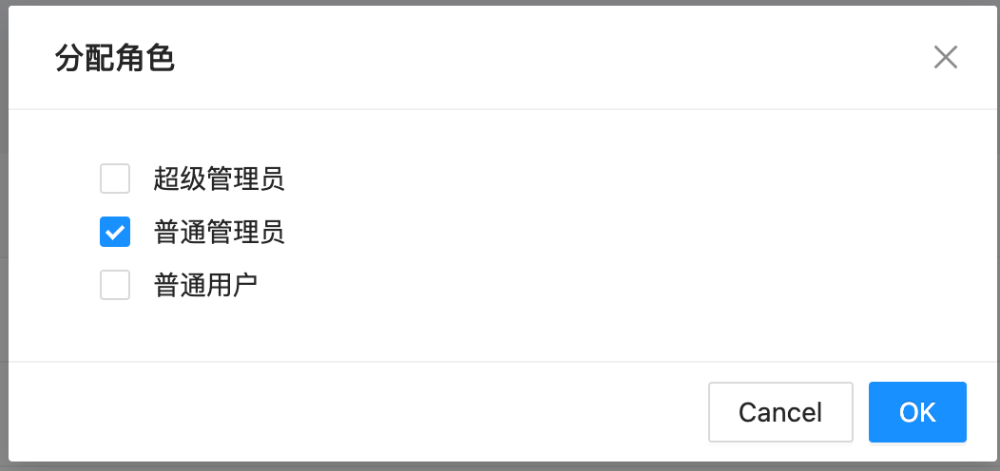

### 角色管理
整个系统分为不同的角色，不同角色能够访问的菜单不同，拥有的权限也不同。
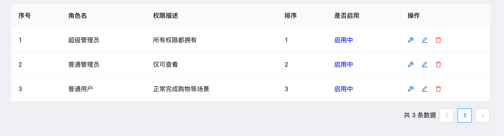

点击分配权限，可以对不同角色的权限进行进一步的分配。同样也包含当前角色可以看到的菜单。

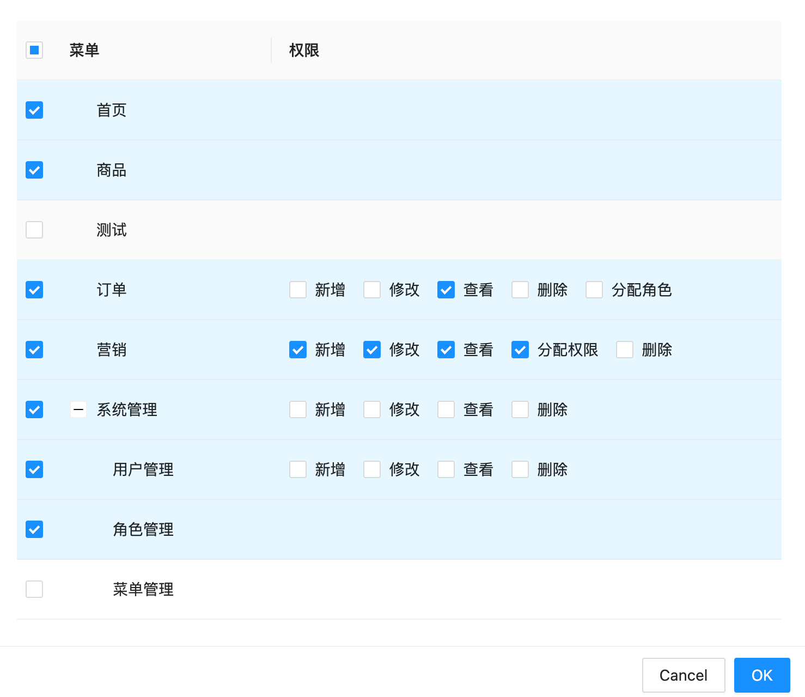